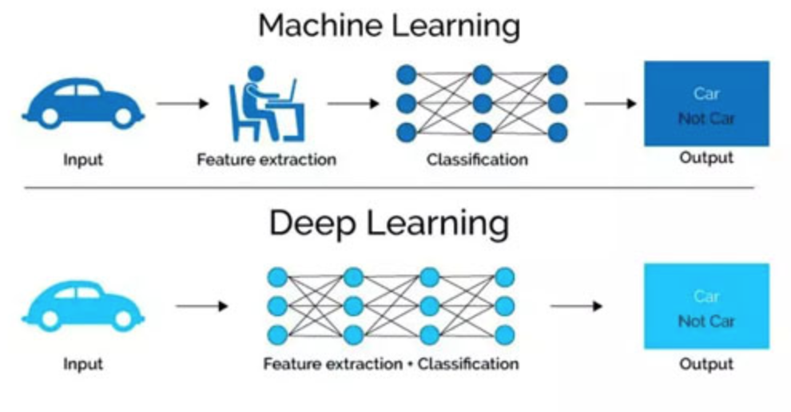
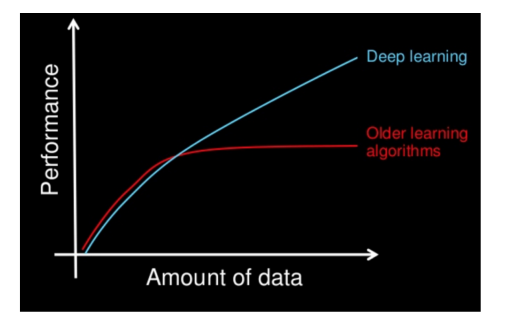

# 1深度学习的介绍

## 目标

1. 知道什么是深度学习
2. 知道深度学习和机器学习的区别
3. 能够说出深度学习的主要应用场景
4. 知道深度学习的常见框架

## 1. 深度学习的概念

**深度学习**（英语：deep learning）是机器学习的分支，是一种以人工神经网络为架构，对数据进行特征学习的算法。

## 2. 机器学习和深度学习的区别

### 2.1 区别1 ：特征提取

从**特征提取**的角度出发：

1. 机器学习需要有人工的特征提取的过程
2. 深度学习没有复杂的人工特征提取的过程，特征提取的过程可以通过深度神经网络自动完成

   

### 2.2 区别2：数据量

从**数据量**的角度出发：

1. 深度学习需要大量的训练数据集，会有更高的效果
2. 深度学习训练深度神经网络需要大量的算力，因为其中有更多的参数

## 3. 深度学习的应用场景

1. 图像识别

   1. 物体识别
   2. 场景识别
   3. 人脸检测跟踪
   4. 人脸身份认证

2. 自然语言处理技术

   1. 机器翻译
   2. 文本识别
   3. 聊天对话

3. 语音技术

   1. 语音识别

   ## 4. 常见的深度学习框架 

   目前企业中常见的深度学习框架有很多，TensorFlow, Caffe2, Keras, Theano, PyTorch, Chainer, DyNet, MXNet, and CNTK等等

   其中tensorflow和Kears是google出品的，使用者很多，但是其语法晦涩而且和python的语法不尽相同，对于入门玩家而言上手难度较高。

   所以在之后的课程中我们会使用facebook出的PyTorch，PyTorch的使用和python的语法相同，整个操作类似Numpy的操作，并且 PyTorch使用的是动态计算，会让代码的调试变的更加简单

   